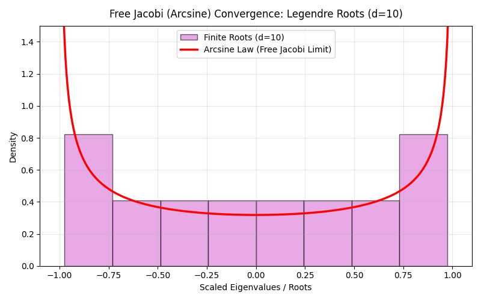
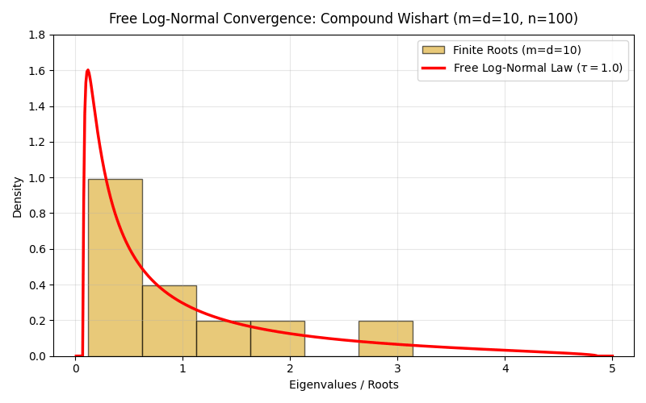

# FiniteFree: Finite Free Probability Library

[](https://opensource.org/licenses/MIT)
[](https://github.com/astral-sh/ruff)
[](http://mypy-lang.org/)
[](https://www.python.org/)

FiniteFree is a precision-focused Python framework designed to operationalize the discrete calculus of finite free probability. It extends classical free probability limits to finite-dimensional polynomial representations (characteristic polynomials), mapping linear deterministic operators against polynomial distributions.

To prevent numerical floating-point drift and avoid the computational complexity of high-order runtime differential operators, FiniteFree implements exact finite free convolutions using discrete algebraic representations, exact generating function recurrences, and arbitrary-precision integer and rational scaling.

## Visual Spectral Convergence Showcase

FiniteFree's exact algebraic convolutions and root isolating engines accurately recover classical limiting distributions as $d \to \infty$. Below are the visualization assets generated natively by the library:

| Wigner Semicircle Convergence ($He_{d} \boxplus_{d} He_{d}$ as $d \to 300$) | Marchenko-Pastur Convergence (Laguerre as $d \to 300$) |
| :---: | :---: |
|  |  |

| Free Jacobi Arcsine Convergence (Legendre as $d \to 300$) | Free Log-Normal Convergence (Wishart as $m=d \to 100$) |
| :---: | :---: |
|  |  |


| Interlacing Preservation Under Convolutions |
| :---: |
|  |


## Features

- **Exact Real-Rooted Polynomial Validation**: Verified lazily via exact rational Sturm sequences.
- **Unitary Circle Geometries ($\mathbb{T}$)**: Implements `UnitaryPolynomial` structures for polynomials with roots strictly on the complex unit circle, bypassing real-line Sturm sequence constraints and isolating angular arguments via complex eigensolvers (e.g., `unitary_hermite_polynomial`).
- **Lazy Geometric Domain Properties**: $O(d)$ lazy algebraic root verification properties (`has_non_negative_roots` and `has_strictly_positive_roots`) evaluated directly on the coefficients using Descartes' Rule of Signs to enforce operators domains without root seeking.
- **Basic Polynomial Transformations**: Supports exact algebraic transformations including variable dilation (`dilation`), variable shift (`shift`), root powers (`power`), root-reciprocal reversing (`reversed_polynomial`), derivative (`derivative`), projection (`projection`), fractional additive convolution power (`additive_power`), and the Fujie-Ueda limiting polynomial $\Phi_d$ (`phi_d`).
- **Orthogonal Polynomial Families**:
  - **Jacobi Polynomials** (`jacobi_polynomial`): Exact $O(n^2)$ recurrence construction of $P_n^{(\alpha, \beta)}(x)$ using `flint.fmpq_poly` in exact rational arithmetic.
  - **Hahn Polynomials** (`hahn_polynomial`): Exact $O(n)$ recurrence construction of $Q_n(x; \alpha, \beta, N)$ using sequential running products to prevent redundant Pochhammer factorial operations.
  - **Jack Polynomials** (`jack_polynomial`): High-performance variables recursion computing symmetric Jack polynomials $J_\lambda^{(\alpha)}(x_1, \dots, x_m)$ strictly over sparse monomial exponent dictionaries, completely bypassing SymPy's slow symbolic expansion engine.
  - **Chebyshev & Legendre Polynomials** (`chebyshev_t_polynomial`, `chebyshev_u_polynomial`, `legendre_polynomial`): Exact recurrence constructions of $T_n(x)$, $U_n(x)$, and $P_n(x)$ over $\mathbb{Q}$ via `flint.fmpq_poly`.
- **High-Degree Scaling & Root Reconstruction**:
  - **Divide-and-Conquer Polynomial Synthesis**: `RealRootedPolynomial.from_roots(roots)` executes a binary splitting tree algorithm operating in $O(d \log^2 d)$ time for high-speed, exact polynomial synthesis.
- **Finite Free Convolutions**:
  - **Symmetric Additive ($\boxplus_d$)**: Exact analytical evaluation mapping polynomial convolutions against the symmetric finite combinatorial variance.
  - **Asymmetric Additive ($\uplus_d$)**: Validated combinatorial operator supporting mixed rank geometry via fractional squared weights.
  - **Multiplicative ($\boxtimes_d$)**: Exact discrete multiplicative root transformations via scaled Hadamard projections.
- **Analytical Finite Transforms**:
  - **Finite Cauchy Transform** ($G_p^{(d)}$)
  - **Finite S-Transform** ($S_p^{(d)}$): Discrete normalized evaluations bypassing non-linear mapping.
  - **Finite R-Transform** ($R_p^{(d)}$): Computes finite free cumulants ($\kappa_n^{(d)}$) via an exact $O(n^2)$ recursive generating function sequence map over $\mathbb{Q}$, bypassing exponential partition lattice enumeration while verifying exact additivity $\kappa_n^{(d)}(p \boxplus_d q) = \kappa_n^{(d)}(p) + \kappa_n^{(d)}(q)$.
  - **Finite T-Transform** ($T_p^{(d)}$): Step function mapping the right-continuous inverse to the Fujie-Ueda limit $\Phi_d$, evaluated in $O(d)$ algebraically using coefficient sign-alternation validation.
  - **Symmetric Finite S-Transform** ($\tilde{S}_p^{(2d)}$): Evaluates the discrete S-Transform over symmetric domains via exact root-squaring maps ($\mathbf{Sq}(p)$), bypassing zero-valued odd coefficients.

- **Multivariate Hyperbolic Geometry & Matrix Pencils**:
  - **`MultivariatePolynomial`**: Homogeneous multivariate polynomials with exact directional derivatives, mixed partials, and homogeneous multinomial normalization.
  - **Compiled Sparse Evaluations**: Features `to_fmpq_mpoly()` for $O(1)$ evaluation and substitution using compiled C-level sparse representations inside the FLINT library.
  - **Jacobi SLP Operations**: Straightline programs evaluating determinant gradients and Hessians via Jacobi's determinant derivative formulas.
  - **Product-Grid Modular Interpolation (CRT)**: Evaluates exact determinant polynomials for symmetric matrix pencils ($n \ge 4$) modulo prime sequences using C-level `nmod_mat` solvers, reconstructing the integer coefficients via the Chinese Remainder Theorem.
  - **Zippel Sparse Interpolation**: Deploys Zippel's probabilistic algorithm over $\mathbb{F}_p$ for sparse determinant evaluations (`from_symmetric_matrix_pencil_sparse`), bounding interpolation complexity to the target monomial count rather than the maximum total-degree combinatorial grid.
  - **Multiplicative Pencils & Diagonal Specialization**: Extends exact matrix pencil geometries to generalized asymmetric forms (`MultiplicativeMatrixPencil`) and computes univariate characteristic projections via optimized 1D Chinese Remainder Theorem loops.
  - **LMI Cone Verification**: Positive definiteness checks ($A(e) \succ 0$) to verify hyperbolic cones.
- **Optimized Memory Pool Management**: Prevents FLINT/GMP memory fragmentation at extreme degrees ($d \ge 1000$) through a conditional, threshold-based garbage collection registry inside `PrecisionContext`.
- **Wilkinson-Proof Numerical Egress**:
  - `to_numpy_poly1d()`: Safe rational coefficient `float64` casting, utilizing arbitrary-precision `decimal.Decimal` fallbacks to prevent `OverflowError` on coefficients with extreme magnitude ratios.
  - `evaluate_roots_float64()`: Uses python-flint's certified complex interval backend (Arb) to isolate roots, ensuring numerical robustness and avoiding Wilkinson's phenomenon.
- **Random Matrix Ensembles (`finitefree.ensembles`)**:
  - **Matrix Samplers**: Fast generation of invariant random matrices for GOE ($O(d)$, $\beta=1$), GUE ($U(d)$, $\beta=2$), and GSE ($USp(2d)$, $\beta=4$).
  - **Empirical Validations**: Computes theoretical expected characteristic polynomials $\mathbb{E}[\det(xI - M)]$ matching explicit orthogonal sequences.

## Installation

This project utilizes `hatchling` and `hatch-cython` to automatically compile Cython extension modules (`modular_fast.pyx`) on install, conforming to PEP 517/621.

### Requirements
- **Python**: `3.9` or higher
- **C Compiler**: A working C compiler (e.g., `gcc` or `clang`) must be available on your system to compile the Cython modules.

### Setup Instructions

1. Clone the repository and initialize a virtual environment:
   ```bash
   python -m venv .venv
   source .venv/bin/activate
   ```
2. Install the package locally:
   * **Standard Install**:
     ```bash
     pip install .
     ```
   * **Development / Testing Install** (includes Cython source compilation in editable mode and dev tools like `pytest`):
     ```bash
     pip install -e ".[dev]"
     ```
- `numpy >= 1.24`
- `sympy >= 1.12`
- `python-flint >= 0.6.0`
- `scipy >= 1.10`
- `cupy` *(Optional, required for GPU-accelerated root finding)*

*Note on Arbitrary-Precision Dependency*: While `python-flint >= 0.6.0` acts as the primary computational engine for strict real and complex root isolation, the user API does not require passing `flint.fmpq_poly` or specialized objects directly. Standard Python lists and NumPy arrays are automatically cast internally to arbitrary-precision environments where necessary.

### Usage Guide

### 1. Polynomial Representation & Transformations

You can construct polynomials exactly from sequences of coefficients or find roots using numerical or certified (Arb) eigensolvers.

```python
from finitefree.core import RealRootedPolynomial
import sympy as sp

# Initialize exactly via rational/integer coefficients: (x - 1)(x - 2) = x^2 - 3x + 2
p = RealRootedPolynomial([1, -3, 2])

# Dilate roots by 2, shift roots by 1, or square the roots exactly
p_dilated = p.dilation(2)             # x^2 - 6x + 8 (roots scaled by 2)
p_shifted = p.shift(1)                # (x - 2)(x - 3) = x^2 - 5x + 6 (roots + 1)
p_powered = p.power(2)                # (x - 1)(x - 4) = x^2 - 5x + 4 (roots squared)
p_reversed = p.reversed_polynomial()  # x^2 - 1.5x + 0.5 (reciprocal roots)

# Fast domain properties evaluated via Descartes' Rule of Signs without root-finding
print(p.has_non_negative_roots)       # True
print(p.has_strictly_positive_roots)  # True

# Perform certified complex interval root isolation (Arb)
roots = p.evaluate_roots_float64(exact=True)
print(roots)  # [1.0, 2.0]
```

### 2. Finite Free Convolutions

Convolutions map discrete algebraic combinations of roots exactly, preserving real-rootedness.

```python
from finitefree.core import RealRootedPolynomial
from finitefree.convolutions import symmetric_additive, asymmetric_additive, multiplicative

# Instantiate two real-rooted polynomials of degree d=2
p = RealRootedPolynomial([1, -3, 2])  # roots: 1, 2
q = RealRootedPolynomial([1, 0, -4])  # roots: -2, 2

# Symmetric Additive Convolution (p [+]_d q)
res_add = symmetric_additive(p, q, d=2)
print(res_add.coeffs)  # [1, 0, -5]

# Asymmetric Additive Convolution (p [u]_d q) with fractional rank weights
res_asym = asymmetric_additive(p, q, weights=[sp.Rational(1, 2), sp.Rational(1, 2)], d=2)
print(res_asym.coeffs)

# Multiplicative Convolution (p [*]_d q)
res_mult = multiplicative(p, q, d=2)
print(res_mult.coeffs)  # Hadamard-like projection
```

### 3. Finite Transforms & Free Cumulants

Finite free probability transforms compute expected spectral properties and algebraic limits without combinatorial partition search.

```python
from finitefree import FiniteRTransform, FiniteTTransform, SymmetricFiniteSTransform
from finitefree.orthogonal import laguerre_polynomial

# Initialize a polynomial (must be non-negative rooted for T-transform)
poly = laguerre_polynomial(n=3, alpha=1)

# Compute Finite Free Cumulants exactly via generating function recurrences (O(d^2))
# Additivity holds: kappa(p [+] q) = kappa(p) + kappa(q)
r_transform = FiniteRTransform(poly)
cumulant_3 = r_transform.get_cumulant(3)
print(f"3rd Finite Free Cumulant: {cumulant_3}")

# Map inverse limit points using the Fujie-Ueda Finite T-Transform
t_transform = FiniteTTransform(poly)
print(t_transform(0.5))
```

### 4. Orthogonal Families & Ensembles

FiniteFree builds classical and symmetric orthogonal systems exactly via optimized recursive relations.

```python
from finitefree.orthogonal import (
    jacobi_polynomial,
    hahn_polynomial,
    jack_polynomial,
    hermite_polynomial,
)
from finitefree.ensembles import GOESampler, expected_characteristic_polynomial

# Construct Jacobi, Hahn, and Hermite recurrence relations exactly over Q
h_prob = hermite_polynomial(n=4, physicist=False)  # Probabilist Hermite He_4
jacobi = jacobi_polynomial(n=3, alpha=1, beta=1)     # Jacobi P_3^(1, 1)
hahn   = hahn_polynomial(n=2, alpha=1, beta=1, N=5)  # Hahn Q_2

# High-performance multivariate Jack polynomials using sparse exponent dicts
jack = jack_polynomial(m=3, partition=[2, 1], alpha=2)
print(jack.coeffs)

# Compare random matrix characteristic polynomials with theoretical sequences
goe = GOESampler(d=4)
M = goe.sample(n_samples=1)[0]
expected_poly = expected_characteristic_polynomial(beta=1, d=4)
print(expected_poly.coeffs)
```

### 5. Multivariate Matrix Pencils

Evaluate homogeneous determinants $\det(x_1 A_1 + \dots + x_m A_m)$ exactly via modular matrix interpolation.

```python
from finitefree.hyperbolic import SymmetricMatrixPencil
from finitefree.multivariate import MultivariatePolynomial
import numpy as np

# Define a matrix pencil
A1 = np.eye(3)
A2 = np.array([[0, 1, 0], [1, 0, 1], [0, 1, 0]])
pencil = SymmetricMatrixPencil([A1, A2])

# Construct the multivariate polynomial exactly using modular determinants and CRT
poly_crt = MultivariatePolynomial.from_symmetric_matrix_pencil_interpolated(pencil)
print(poly_crt.expr)

# Or utilize Zippel's randomized sparse interpolation over finite fields
poly_sparse = MultivariatePolynomial.from_symmetric_matrix_pencil_sparse(pencil)
print(poly_sparse.expr)
```

### 6. Determinantal Point Processes (DPPs)

Construct correlation kernels, evaluate k-point joint intensities exactly, compute Fredholm determinant gap probabilities, and sample point configurations algebraically.

```python
from finitefree import (
    DiscreteFiniteKernel,
    OrthogonalPolynomialKernel,
    hermite_polynomial,
    gap_probability_discrete,
    gap_probability_continuous,
    sample_discrete,
)
import numpy as np
import math

# --- 1. Discrete DPP Kernel & Exact Gap Probability ---
# 3x3 projection matrix of rank 2
K_mat = [
    [2/3, 1/3, 0.0],
    [1/3, 2/3, 0.0],
    [0.0, 0.0, 1.0],
]
discrete_kernel = DiscreteFiniteKernel(K_mat)

# Exact gap probability on states {0, 1}: det(I - K_{[0,1]})
prob_discrete = gap_probability_discrete(discrete_kernel, [0, 1])
print(f"Exact Gap Probability on {{0,1}}: {prob_discrete}")  # 0

# --- 2. Orthogonal Polynomial Kernel & CD Formula ---
# Probabilist's Hermite polynomials for GUE / Wigner ensemble DPP
norms = [1, 1, 2] # h_0, h_1, h_2
polys = [
    hermite_polynomial(0, physicist=False),
    hermite_polynomial(1, physicist=False),
    hermite_polynomial(2, physicist=False),
    hermite_polynomial(3, physicist=False),
]
hermite_kernel = OrthogonalPolynomialKernel(polys, norms)

# Evaluate kernel off-diagonal and diagonal (CD derivatives)
print(f"CD Kernel K(0.5, 1.2): {hermite_kernel(0.5, 1.2)}")
print(f"CD Kernel Diagonal K(0.5, 0.5): {hermite_kernel(0.5, 0.5)}")

# --- 3. Continuous Fredholm Determinant ---
# Hermite orthogonal polynomial weight function
def weight_func(x):
    return math.exp(-x**2 / 2.0) / math.sqrt(2.0 * math.pi)

gap_prob = gap_probability_continuous(hermite_kernel, -1.0, 1.0, n_points=20, weight_func=weight_func)
print(f"Continuous Gap Probability over [-1.0, 1.0]: {gap_prob}")

# --- 4. HKPV Discrete Sampling ---
sampled_states = sample_discrete(discrete_kernel, state_space=[0, 1, 2])
print(f"HKPV Sampled point configuration: {sampled_states}")
```

## Computational Complexity & Architecture

FiniteFree is architected to bypass the combinatorial bottlenecks inherent in high-order differential operators, combinatorial partition counts, and eager root validation. It achieves this by executing convolutions, algebraic transforms, and matrix interpolations directly on polynomial coefficient sequences in C, leveraging `python-flint`'s arbitrary-precision integer/rational arithmetic.

### Complexity Matrix of Key Operations

| Operation | Mathematical Method | Time Complexity | Arithmetic Space |
| :--- | :--- | :---: | :---: |
| **Polynomial Multiplication** | C-level FFT / Kronecker substitution | $O(d \log d)$ | Exact $\mathbb{Q}$ |
| **Root Reconstruction (`from_roots`)** | Binary divide-and-conquer splitting tree | $O(d \log^2 d)$ | Exact $\mathbb{Q}$ |
| **Symmetric Additive Convolution ($\boxplus_d$)** | EGF coefficient multiplication | $O(d \log d)$ | Exact $\mathbb{Q}$ |
| **Asymmetric Additive Convolution ($\uplus_d$)** | Cauchy product of scaled sequences | $O(d \log d)$ | Exact $\mathbb{Q}$ |
| **Multiplicative Convolution ($\boxtimes_d$)** | Pointwise multiplication of normalized coefficients | $O(d)$ | Exact $\mathbb{Q}$ |
| **Sturm Real-Rootedness Verification** | Subresultant Polynomial Remainders Sequence (PRS) | $O(d^2)$ | Exact $\mathbb{Q}$ |
| **Certified Root Isolation (Arb)** | Belyi-like complex interval bisection | $O(d^2)$ | Interval $\mathbb{C}$ |
| **Fast Root Approximation** | Balanced companion matrix eigenvalues | $O(d^2)$ | Float $\mathbb{C}$ |
| **Finite R-Transform (Cumulants)** | Generating function recurrence relation | $O(d^2)$ | Exact $\mathbb{Q}$ |

### Architectural Design Principles

#### 1. Exact-to-Approximate Hybrid Pipeline
All algebraic operations, polynomial recurrences, and convolutions are computed in exact rational arithmetic ($\mathbb{Q}$) using GMP/FLINT backends (`fmpq_poly`). Floating-point approximations are deferred entirely to the final egress stage (e.g. root isolation or evaluation), preventing early-stage rounding errors and numerical drift from compounding during intensive convolution chains.

#### 2. Algebraic Domain Verification (Sturm PRS)
Instead of seeking roots numerically to check domain boundaries (such as verifying real-rootedness of a convolution), the library employs exact algebraic verification. For polynomials of degree $d \le 30$, FiniteFree evaluates Sturm sequences using Euclidean division modulo in C. For higher degrees, it uses a subresultant Polynomial Remainder Sequence (PRS) to compute Sturm sequences without coefficient growth. If certified bounds are needed, it falls back to Flint’s complex interval bisection (Arb).

#### 3. Partition-Free Cumulant Recurrences
Rather than explicitly constructing combinatorial structures (such as enumerating non-crossing partitions to calculate free cumulants), FiniteFree solves the finite $R$-transform and $S$-transform relationships using direct generating function recurrences. By rewriting the underlying algebraic equations into coefficient-level recurrence relations, the combinatorial explosion is reduced to a deterministic $O(d^2)$ exact rational arithmetic sweep.

#### 4. High-Performance Multivariate Matrix Pencil Interpolation
To evaluate multivariate pencils of the form $\det(x_1 A_1 + \dots + x_m A_m)$, the library avoids symbolic determinant bottlenecks via three complementary strategies:
* **Cython-Accelerated Modular Determinants**: Matrix evaluations are mapped to machine-precision finite fields $\mathbb{F}_p$ for fast C-level Gaussian elimination.
* **Chinese Remainder Theorem (CRT) Reconstruction**: Coefficients computed over multiple distinct prime fields are reconstructed back to exact large integers/rationals over $\mathbb{Q}$.
* **Zippel's Sparse Polynomial Interpolation**: Instead of using an exponential dense grid (which requires $O(n^m)$ points), Zippel's randomized algorithm discovers the non-zero monomial support of the polynomial step-by-step over finite fields, drastically reducing evaluation costs for sparse pencils.


## Testing Protocol

FiniteFree ships with a consolidated robust verification suite designed to run under `pytest`. 

```bash
pytest tests/
```

- **`test_core.py`**: Real-rootedness verification, divide-and-conquer root synthesis, and sequence extractions.
- **`test_transformations.py`**: Exact algebraic variable scaling (dilation), shifts, powers, and reciprocal-root polynomial transformations.
- **`test_convolutions.py`**: Additive and multiplicative explicit formulas and hyperbolic geometry preservation.
- **`test_transforms.py`**: Exact recursive generating functions and high-order finite free cumulant strict additivity ($\kappa_n^{(d)}$).
- **`test_empirical.py`**: Expected characteristic polynomial identities for GOE ($\beta=1$), GUE ($\beta=2$), and GSE ($\beta=4$) random matrix ensembles using the `ensembles` module.
- **`test_hyperbolic.py`**: Multivariate homogeneous polynomials, CRT grid interpolations, sparse FLINT arrays, and Jacobi SLP evaluations.
- **`test_orthogonal.py`**: Exact hypergeometric and multivariate orthogonal polynomial families (Jacobi, Hahn, Jack).

## References

The theoretical architecture and exact computational operators implemented in FiniteFree are grounded in the following foundational literature across finite free probability, classical asymptotic free probability, and random matrix theory.

### Finite Free Probability
* Arizmendi, O., Fujie, K., Perales, D., & Ueda, Y. (2026). *S-transform in finite free probability*. *Advances in Mathematics*, 489, 110803.
* Marcus, A., Spielman, D. A., & Srivastava, N. (2015). *Interlacing families I: Bipartite Ramanujan graphs of all degrees*. *Annals of Mathematics*, 182(1), 307–325.
* Marcus, A., Spielman, D. A., & Srivastava, N. (2022). *Finite free convolutions of polynomials*. *Probability Theory and Related Fields*, 182(3–4), 807–848.

### Classical Free Probability & Asymptotic Limits
* Nica, A., & Speicher, R. (2006). *Lectures on the Combinatorics of Free Probability*. Cambridge University Press.
* Tucci, G. H. (2010). *Limit laws for geometric means of free random variables*. *Indiana University Mathematics Journal*, 59(1), 1–13.
* Voiculescu, D. V., Dykema, K. J., & Nica, A. (1992). *Free Random Variables*. American Mathematical Society.

### Orthogonal Polynomials & Random Matrix Ensembles
* Anderson, G. W., Guionnet, A., & Zeitouni, O. (2010). *An Introduction to Random Matrices*. Cambridge University Press.
* Dumitriu, I., & Edelman, A. (2002). *Matrix models for beta ensembles*. *Journal of Mathematical Physics*, 43(11), 5830–5847.
* Forrester, P. J. (2010). *Log-Gases and Random Matrices* (LMS-34). Princeton University Press.
* Macdonald, I. G. (1995). *Symmetric Functions and Hall Polynomials* (2nd ed.). Oxford University Press.
* Mehta, M. L. (2004). *Random Matrices* (3rd ed.). Elsevier.
* Szegő, G. (1975). *Orthogonal Polynomials* (4th ed., Vol. 23). American Mathematical Society, Colloquium Publications.

