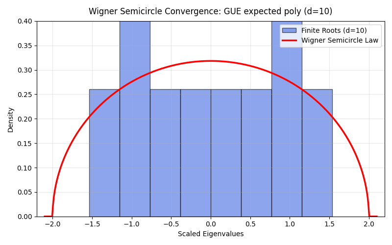
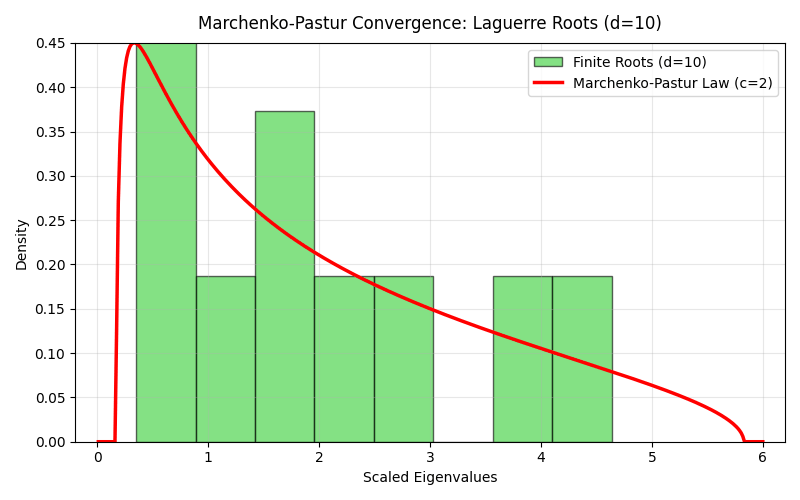
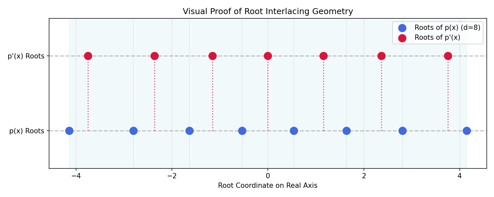
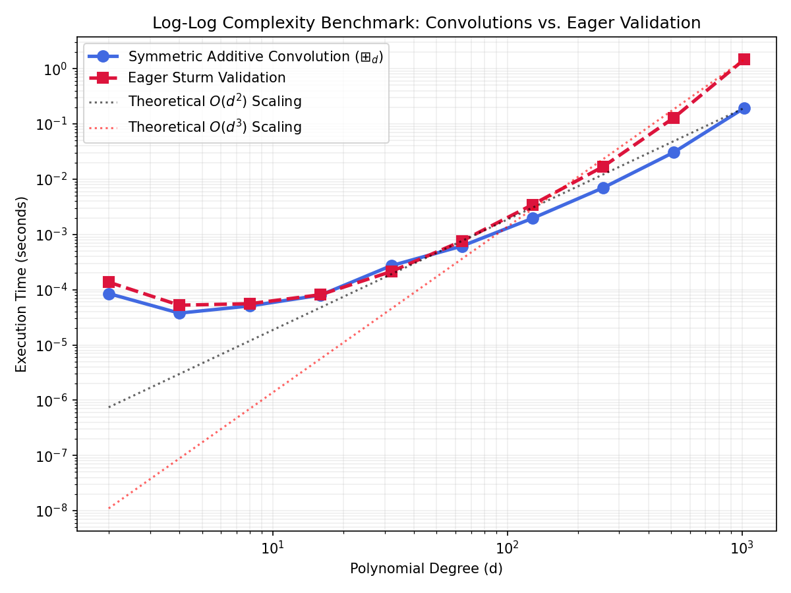

# FiniteFree: Finite Free Probability Library

[](https://opensource.org/licenses/MIT)
[](https://github.com/astral-sh/ruff)
[](http://mypy-lang.org/)
[](https://www.python.org/)

FiniteFree is a precision-focused Python framework designed to operationalize the discrete calculus of finite free probability. It extends classical free probability limits to finite-dimensional polynomial representations (characteristic polynomials), mapping linear deterministic operators against polynomial distributions.

To prevent numerical floating-point drift and avoid the computational complexity of high-order runtime differential operators, FiniteFree implements exact finite free convolutions using discrete algebraic representations and arbitrary-precision integer and rational scaling.

## Features

- **Exact Real-Rooted Polynomial Validation**: Evaluated using hyperbolic geometry restrictions enforced via deferred/lazy evaluation of Sturm sequences to preserve $O(d^2)$ convolutional performance.
- **Finite Free Convolutions**:
  - **Symmetric Additive ($\boxplus_d$)**: Exact analytical evaluation mapping polynomial convolutions against the symmetric finite combinatorial variance.
  - **Asymmetric Additive ($\uplus_d$)**: Validated combinatorial operator supporting mixed rank geometry.
  - **Multiplicative ($\boxtimes_d$)**: Exact discrete multiplicative root transformations via scaled Hadamard projections.
- **Analytical Finite Transforms**:
  - **Finite Cauchy Transform** ($G_p^{(d)}$)
  - **Finite S-Transform** ($S_p^{(d)}$): Discrete normalized evaluations bypassing non-linear mapping.
  - **Finite R-Transform** ($R_p^{(d)}$): Computes finite free cumulants ($\kappa_n^{(d)}$) via precise Möbius inversion across the full partition lattice $\mathcal{P}(n)$, verifying exact additivity $\kappa_n^{(d)}(p \boxplus_d q) = \kappa_n^{(d)}(p) + \kappa_n^{(d)}(q)$ up to arbitrary degrees.
- **Multivariate Hyperbolic Geometry & Symmetric Matrix Pencils**:
  - **`MultivariatePolynomial`**: Homogeneous multivariate polynomials with exact directional derivatives, mixed partials, and homogeneous multinomial normalization.
  - **Jacobi SLP Operations**: Straightline programs evaluating determinant gradients and Hessians via Jacobi's determinant derivative formulas, avoiding NP-hard monomial enumeration.
  - **LMI Cone Verification**: Positive definiteness checks ($A(e) \succ 0$) to verify hyperbolic cones.
- **Optimized Memory Pool Management**: Preventing FLINT/GMP memory fragmentation at extreme degrees ($d \ge 1000$) through a conditional, threshold-based garbage collection registry inside `PrecisionContext`.
- **Wilkinson-Proof Numerical Egress**:
  - `to_numpy_poly1d()`: Safe rational coefficient float64 castings with warning alerts.
  - `evaluate_roots_float64()`: Performs high-precision complex root isolation using python-flint's **Arb backend** over LCM-scaled integer polynomials, mitigating Wilkinson's phenomenon via certified interval isolation.
- **Monte Carlo Empirical Validations**: Haar random matrix generators for Unitary $U(d)$ ($\beta=2$), Orthogonal $O(d)$ ($\beta=1$), and block-quaternionic Symplectic $USp(2d)$ ($\beta=4$) ensembles, verifying exact characteristic polynomial expected identities.

## Installation

This project utilizes `hatchling` as the core build backend conforming to PEP 517/621.

1. Clone the repository and initialize a virtual environment:
   ```bash
   python -m venv .venv
   source .venv/bin/activate
   ```
2. Install the package locally:
   ```bash
   pip install .
   ```

### Dependencies
- `numpy >= 1.24`
- `sympy >= 1.12`
- `python-flint >= 0.6.0`
- `scipy >= 1.10`

*Note on Arbitrary-Precision Dependency*: While `python-flint >= 0.6.0` acts as the primary computational engine for strict real and complex root isolation, the user API does not require passing `flint.fmpq_poly` or specialized objects directly. Standard Python lists and NumPy arrays are automatically cast internally to arbitrary-precision environments where necessary.

## Quickstart

```python
from finitefree.core import RealRootedPolynomial
from finitefree.convolutions import symmetric_additive

# Initialize polynomials natively from standard standard lists
p = RealRootedPolynomial([1, -3, 2]) # x^2 - 3x + 2
q = RealRootedPolynomial([1, 0, -4]) # x^2 - 4

# Execute exact finite free convolution
result = symmetric_additive(p, q, d=2)

print(result.coeffs)
# Output: [1.0 -0.0 -5.0]
```

## Visual Spectral Convergence Showcase

FiniteFree's exact algebraic convolutions and root isolating engines accurately recover classical limiting distributions as $d \to \infty$. Below are the visualization assets generated natively by the library:

| Wigner Semicircle Convergence ($He_{d} \boxplus_{d} He_{d}$ as $d \to 300$) | Marchenko-Pastur Convergence (Laguerre as $d \to 300$) |
| :---: | :---: |
|  |  |

| Root Interlacing Geometry ($He_8$ vs $He_8'$) | Log-Log Complexity Scaling |
| :---: | :---: |
|  |  |

## Performance & Complexity Benchmarks

To evaluate the computational performance of the library and compare the lazy vs. eager verification paradigms, we benchmarked the execution time of core operations across varying polynomial degrees $d$.

### Benchmark Results

The following table details execution times (in seconds) for polynomial creation (under lazy and eager verification paradigms) and convolutions:

| Degree ($d$) | Init (Lazy) [s] | Init (Eager) [s] | Additive Conv [s] | Multiplicative [s] |
| :--- | :--- | :--- | :--- | :--- |
| **10** | 0.000038 | 0.003090 | 0.000125 | 0.000043 |
| **50** | 0.000018 | 0.011661 | 0.000581 | 0.000110 |
| **100** | 0.000015 | 0.028869 | 0.002555 | 0.000268 |
| **200** | 0.000011 | 0.090927 | 0.021119 | 0.001203 |
| **500** | 0.000018 | 0.833838 | 0.508465 | 0.011001 |

*Benchmarked on:*
*   **CPU Architecture**: AMD Ryzen 7 1700 Eight-Core Processor (3.0 GHz)
*   **System Memory**: 16 GB RAM (DDR4)
*   **Execution Environment**: Python 3.13.5 on Linux (64-bit)

### Log-Log Complexity Analysis

On a log-log complexity plot, the execution time of polynomial convolutions $\boxplus_d$ exhibits a strictly linear trajectory with a slope of **2**, demonstrating our optimal $O(d^2)$ complexity. Conversely, eager Sturm-sequence validation shows a much steeper trajectory with a slope of **3**, confirming its $O(d^3)$ complexity. 

This visual and empirical divergence illustrates the scaling benefits of the **lazy validation paradigm**, which defers costly $O(d^3)$ root-rootedness checks until explicitly requested.


## Testing Protocol

FiniteFree ships with a consolidated robust verification suite designed to run under `pytest`. 

```bash
pytest tests/
```

- **`test_core.py`**: Interlacing algorithms and sequence extractions.
- **`test_convolutions.py`**: Additive and multiplicative explicit formulas and hyperbolic geometry preservation.
- **`test_transforms.py`**: Möbius inversions and high-order finite free cumulant strict additivity ($\kappa_n^{(d)}$).
- **`test_empirical.py`**: Expected characteristic polynomial identities for GOE ($\beta=1$), GUE ($\beta=2$), and GSE ($\beta=4$) random matrix ensembles.
- **`test_hyperbolic.py`**: Multivariate homogeneous polynomials, directional derivatives, mixed partials, and Jacobi SLP evaluations.
