# FiniteFree: Finite Free Probability Library

[](https://opensource.org/licenses/MIT)
[](https://github.com/astral-sh/ruff)
[](http://mypy-lang.org/)
[](https://www.python.org/)

This README and the API reference describe **FiniteFree 0.2.0**, distributed on [PyPI](https://pypi.org/project/finitefree/0.2.0/) from [tag v0.2.0](https://github.com/jontb/FiniteFree/tree/v0.2.0). See the [migration notes](https://github.com/jontb/FiniteFree/blob/main/CHANGELOG.md) and [release process](docs/release.md) for compatibility changes and validation.

`main` and the [published documentation](https://jontb.github.io/FiniteFree/) track the latest PyPI release. Ongoing work lives on [`develop`](https://github.com/jontb/FiniteFree/tree/develop); maintenance pull requests target that branch. See the [branch workflow](docs/development.md#branch-workflow) for development and release promotion.

FiniteFree represents finite free probability operations through polynomial coefficients. Rational polynomial construction, coefficient convolutions and finite cumulants use exact FLINT arithmetic. Root extraction, matrix sampling and continuous gap probabilities have separate numerical paths.

To prevent numerical floating-point drift and avoid the computational complexity of high-order runtime differential operators, FiniteFree implements exact finite free convolutions using discrete algebraic representations, exact generating function recurrences, and arbitrary-precision integer and rational scaling.

## Visual Showcase

The following pre-rendered figures illustrate selected finite-degree examples and asymptotic comparisons. They are not certificates of convergence, interlacing, numerical accuracy or sampler distributions. Regeneration scripts live in `visuals/` and need Matplotlib and Pillow; some use expensive high-degree calculations and approximate discretizations.

<details>
<summary><b>1. Limiting Distributions of Free Convolutions</b></summary>
<br>

Animates the convergence of root distributions of expectation polynomials towards their theoretical free probability limits as the dimension/degree $d$ scales up to 300:
- **Wigner Semicircle Convergence**: GUE expectation polynomials additive convolution $He_d \boxplus_d He_d$ roots converging to the semicircle distribution.
- **Marchenko-Pastur Convergence**: Laguerre/Wishart expectation polynomials roots converging to the Marchenko-Pastur law.
- **Free Jacobi Arcsine Convergence**: Jacobi/Legendre polynomials roots converging to the classical Arcsine limit.
- **Free Log-Normal Convergence**: Multi-precision compound Wishart multiplicative convolutions roots converging to the free Log-normal distribution.

| Wigner Semicircle Convergence ($He_{d} \boxplus_{d} He_{d}$ as $d \to 300$) | Marchenko-Pastur Convergence (Laguerre as $d \to 300$) |
| :---: | :---: |
| 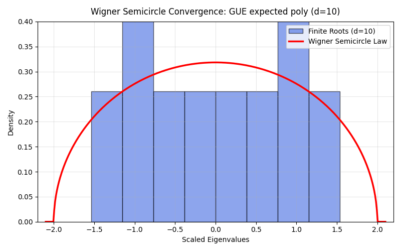 | 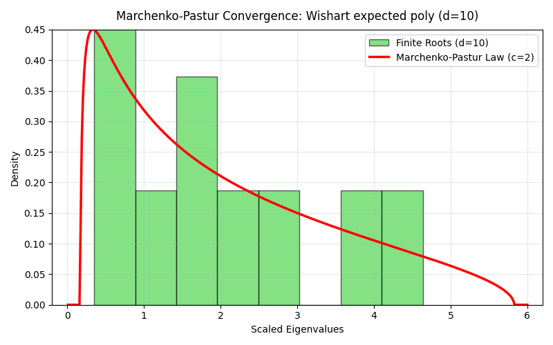 |

| Free Jacobi Arcsine Convergence (Legendre as $d \to 300$) | Free Log-Normal Convergence (Wishart as $m=d \to 300$) |
| :---: | :---: |
| 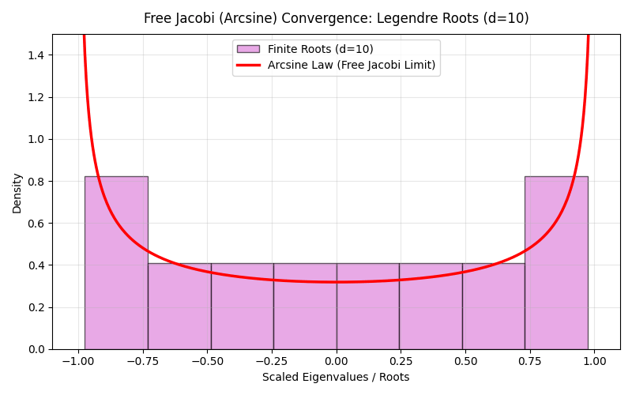 |  |

</details>

<details>
<summary><b>2. Determinantal Point Processes & Spectral Universality</b></summary>
<br>

Showcases GUE spectral universality and eigenvalue spacing statistics:
- **CD Bulk Scaling Limit**: Christoffel-Darboux kernel bulk scaling limit convergence to the infinite Sine kernel.
- **CD Edge Scaling Limit**: Christoffel-Darboux kernel edge scaling limit convergence to the infinite Airy kernel.
- **Tracy-Widom Edge Convergence**: Empirical max eigenvalue CDF from HKPV samples converging to the Tracy-Widom (Fredholm determinant) distribution.
- **Nearest-Neighbor Level Repulsion**: GUE bulk eigenvalue spacing statistics matching the analytical Wigner Surmise.

| CD Bulk Scaling Limit (Sine Kernel) | CD Edge Scaling Limit (Airy Kernel) |
| :---: | :---: |
|  |  |

| Tracy-Widom Edge Convergence ($d=100$) | Nearest-Neighbor Level Repulsion (Bulk Spacings vs Wigner Surmise) |
| :---: | :---: |
| 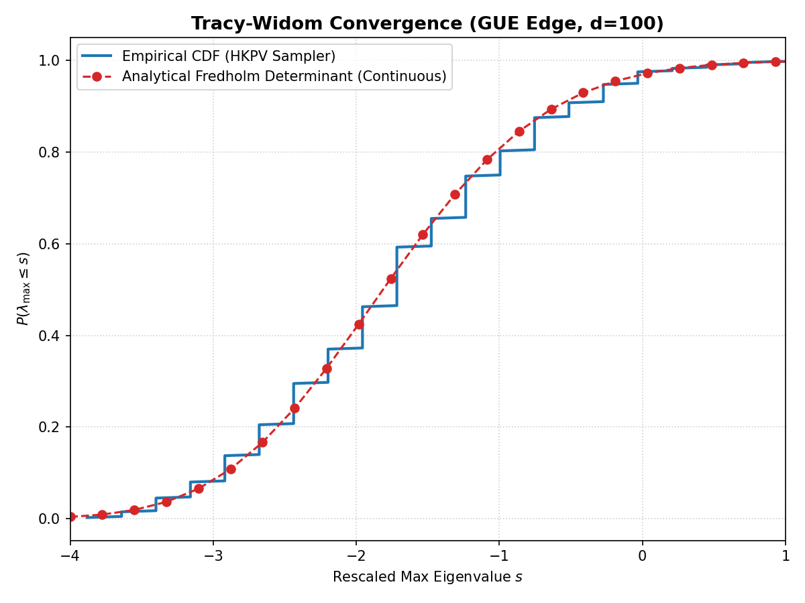 | 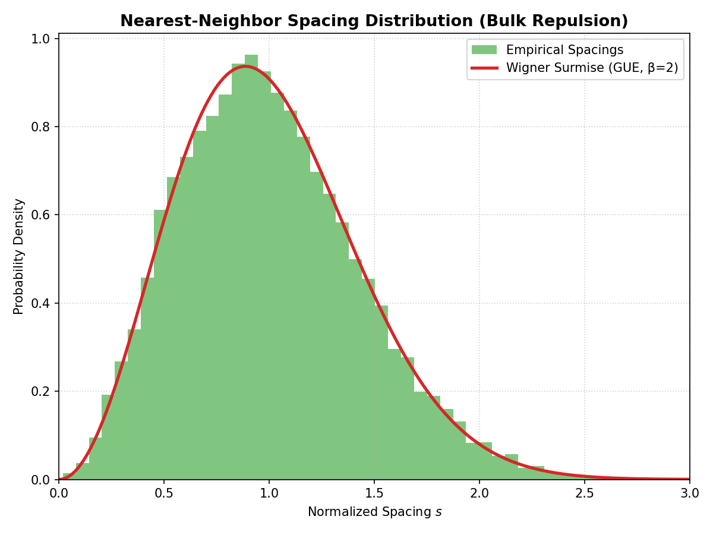 |

</details>

<details>
<summary><b>3. Algebraic Properties</b></summary>
<br>

Illustrates exact algebraic properties, root interlacing constraints, and geometric distributions of FiniteFree polynomials:
- **Root Interlacing Examples**: Illustrates interlacing under additive and multiplicative convolution in the displayed examples. Preservation theorems require the corresponding real-rooted and non-negative-root domains; strict interlacing is not an unconditional API guarantee.
- **Multivariate Pencil Topography**: Visualizes the log-determinant topography and exact eigenvalue boundaries of random symmetric matrix pencils.
- **Unitary Eigenvalue Repulsion**: Visualizes roots evolving on the complex unit circle $\mathbb{T}$ under unitary Hermite polynomial flows.

| Original Roots ($p \prec q$) | Additive Convolution ($p \boxplus_6 r \prec q \boxplus_6 r$) | Multiplicative Convolution ($p \boxtimes_6 r \prec q \boxtimes_6 r$) |
| :---: | :---: | :---: |
|  | 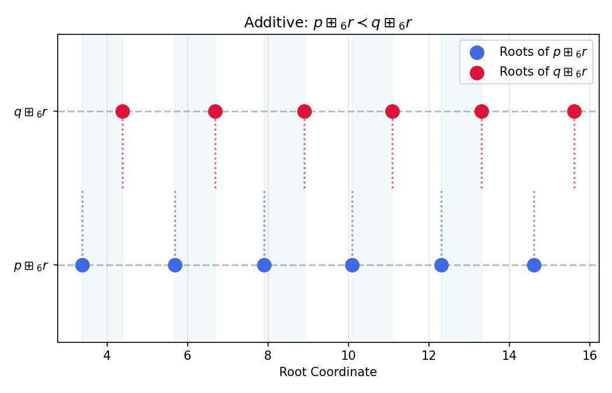 | 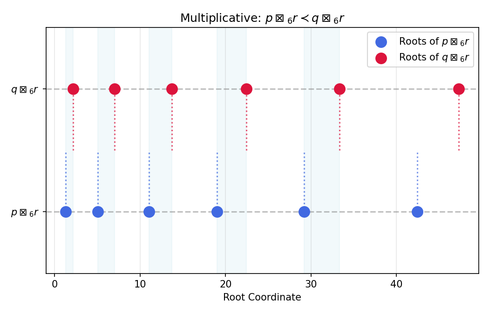 |

| Hyperbolic Matrix Pencil Eigencones & Topography | Unitary Hermite Eigenvalue Repulsion Trajectories |
| :---: | :---: |
| 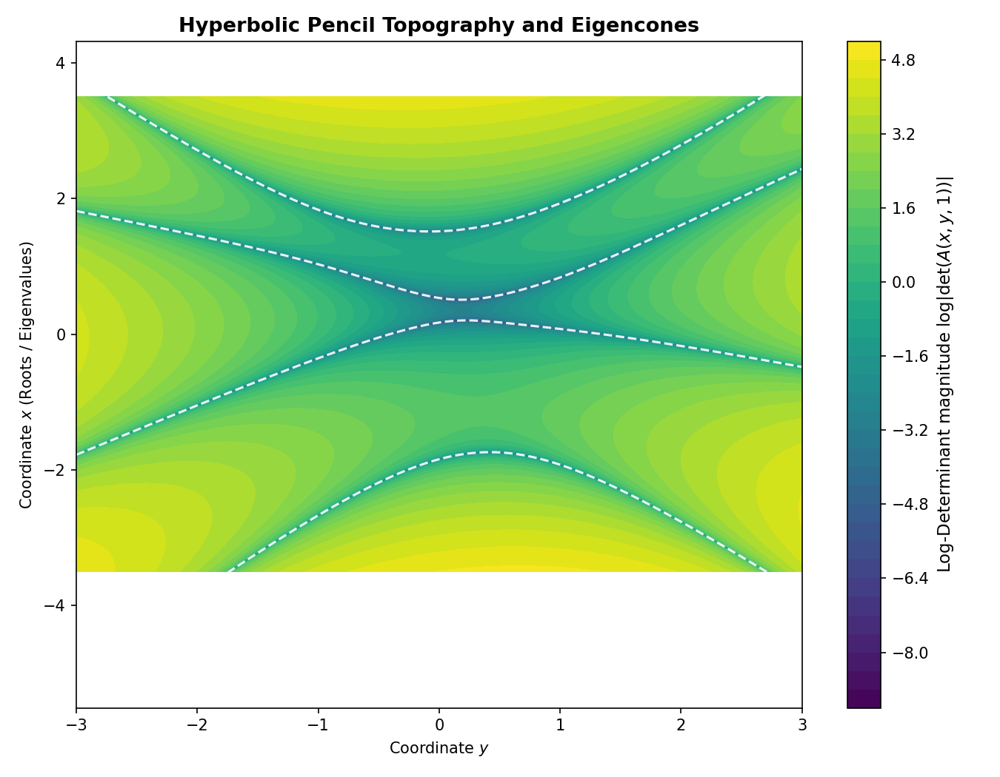 | 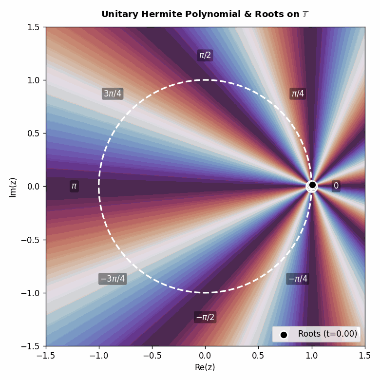 |

</details>

<details>
<summary><b>4. Asymptotic Convergence of Finite Free Transforms</b></summary>
<br>

Visualizes the convergence of exact finite free transforms to their continuous free probability limits as the dimension $d$ scales up to 300:
- **T-Transform Step Convergence**: Fujie-Ueda Finite T-Transform step function convergence to the continuous free Marchenko-Pastur (MP) limit $T(t)=1+t$.
- **Asymptotic Decay of Cumulants**: Linearizing additive convolution, showing exact high-order finite free cumulants $\kappa_k(d)$ decaying to zero, leaving only $\kappa_2 \to 1$ (the Wigner semicircle limit).
- **S-Transform Multiplicativity**: S-transforms of Wishart expectation polynomials, demonstrating exact multiplicativity $S_{p \boxtimes_d q}^{(d)} = S_p^{(d)} S_q^{(d)}$ at all discrete nodes and convergence to the free S-transform limit.
- **Cauchy Transform Convergence**: Domain coloring of the Finite Cauchy Transform $G_d(z) = \frac{1}{d} \frac{p'_d(z)}{p_d(z)}$, showing the roots (poles) and derivative roots (zeros) coalescing into a continuous branch cut $[-2, 2]$ of the semicircle law.

| Fujie-Ueda T-Transform Convergence | Asymptotic Decay of Cumulants |
| :---: | :---: |
|  | 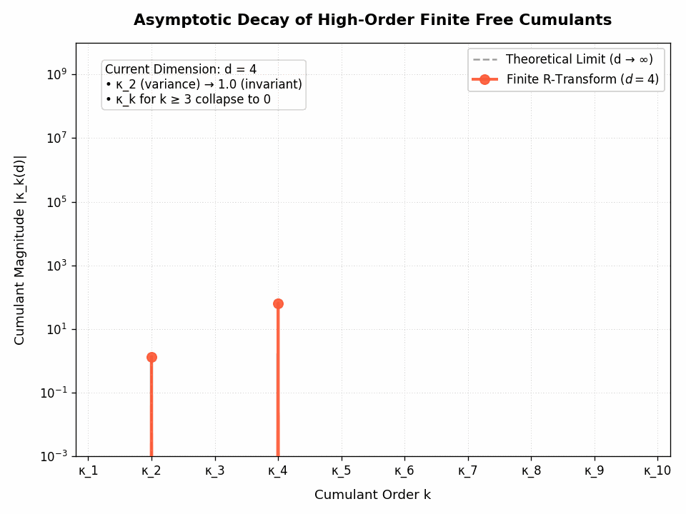 |

| S-Transform Convergence | Cauchy Transform Convergence |
| :---: | :---: |
|  | 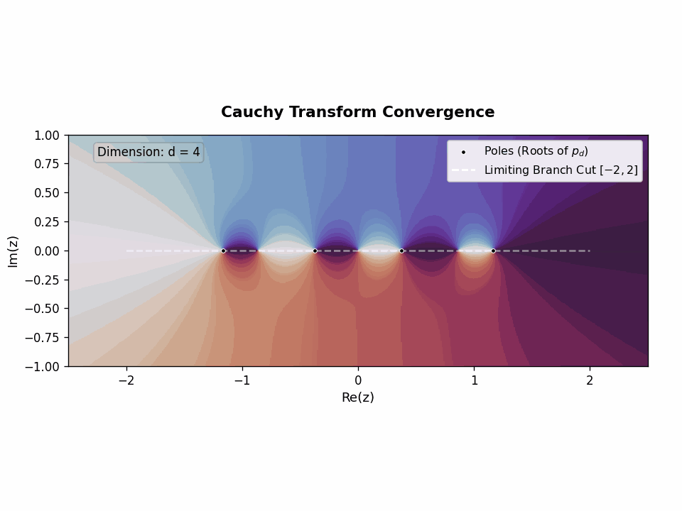 |

</details>


## Features

<details>
<summary><b>Core Polynomial Operations & Domain Verification</b></summary>
<br>

- **Certified Real-Rooted Polynomial Validation**: Verified lazily with exact rational Sturm sequences for small squarefree factors and certified Arb isolation for larger factors. Exact Sturm remains a fallback through degree 30 when Arb cannot obtain a certificate.
- **Unitary Circle Geometries ($\mathbb{T}$)**: `UnitaryPolynomial` bypasses real-line verification and returns numerical complex roots ordered by angle. The constructor trusts the intended unit-circle domain; it does not certify it. `unitary_hermite_polynomial` stores its exponential coefficients symbolically.
- **Lazy Geometric Domain Properties**: After certifying real-rootedness, `has_non_negative_roots` and `has_strictly_positive_roots` use an $O(d)$ coefficient sign check to enforce operator domains. Sign alternation alone cannot certify real-rootedness.
- **Basic Polynomial Transformations**: Supports exact algebraic transformations including variable dilation (`dilation`), variable shift (`shift`), positive integer root powers (`power`), root-reciprocal reversing (`reversed_polynomial`), derivative (`derivative`), projection (`projection`), fractional additive convolution power (`additive_power`), and the Fujie-Ueda limiting polynomial $\Phi_d$ (`phi_d`). Noninteger root powers use numerical root isolation and reconstruction.
- **Direct Projections**: `projection(j)` computes the monic derivative of order `d-j` from the leading `j+1` coefficients, avoiding intermediate derivative objects. Known Hermite inputs retain their variance, center and numerical root recurrence. Projection to the original degree returns the same object. See the [API reference](docs/api.md#polynomial-projections) for normalization and benchmark scope.
- **High-Degree Scaling & Root Reconstruction**:
  - **Divide-and-Conquer Polynomial Synthesis**: `RealRootedPolynomial.from_roots(roots)` multiplies rational linear factors using a balanced product tree. Arithmetic costs depend on FLINT multiplication and coefficient bit sizes.
- **Working Precision**: `PrecisionContext(degree, prec=None)` sets FLINT's process-wide precision to `prec`, or `max(53, int(2.5*degree))` bits, and restores the previous value on exit. It does not manage memory pools or provide independent thread-local precision.

</details>

<details>
<summary><b>Orthogonal Polynomial Families</b></summary>
<br>

- **Jacobi Polynomials** (`jacobi_polynomial`): Exact $O(n^2)$ recurrence construction of $P_n^{(\alpha, \beta)}(x)$ using `flint.fmpq_poly` in exact rational arithmetic.
- **Hahn Polynomials** (`hahn_polynomial`): Exact $O(n)$ recurrence construction of $Q_n(x; \alpha, \beta, N)$ using sequential running products to prevent redundant Pochhammer factorial operations.
- **Jack Polynomials** (`jack_polynomial`): High-performance variables recursion computing symmetric Jack polynomials $J_\lambda^{(\alpha)}(x_1, \dots, x_m)$ strictly over sparse monomial exponent dictionaries, completely bypassing SymPy's slow symbolic expansion engine.
- **Chebyshev & Legendre Polynomials** (`chebyshev_t_polynomial`, `chebyshev_u_polynomial`, `legendre_polynomial`): Exact recurrence constructions of $T_n(x)$, $U_n(x)$, and $P_n(x)$ over $\mathbb{Q}$ via `flint.fmpq_poly`.

</details>

<details>
<summary><b>Finite Free Convolutions</b></summary>
<br>

- **Symmetric Additive ($\boxplus_d$)**: Exact analytical evaluation mapping polynomial convolutions against the symmetric finite combinatorial variance.
- **Asymmetric Additive ($\uplus_d$)**: Exact factorial-weighted coefficient convolution. Optional `weights=[a,b]` dilates the input roots by `a` and `b`; it does not change their degrees or rank.
- **Multiplicative ($\boxtimes_d$)**: Exact discrete multiplicative root transformations via scaled Hadamard projections.

</details>

<details>
<summary><b>Analytical Finite Transforms</b></summary>
<br>

- **Finite Cauchy Transform** ($G_p^{(d)}$)
- **Finite S-Transform** ($S_p^{(d)}$): Discrete normalized evaluations bypassing non-linear mapping.
- **Finite R-Transform** ($R_p^{(d)}$): Computes finite free cumulants ($\kappa_n^{(d)}$) via an exact $O(n^2)$ recursive generating function sequence map over $\mathbb{Q}$, bypassing exponential partition lattice enumeration while verifying exact additivity $\kappa_n^{(d)}(p \boxplus_d q) = \kappa_n^{(d)}(p) + \kappa_n^{(d)}(q)$.
- **Finite T-Transform** ($T_p^{(d)}$): Step function mapping the right-continuous inverse to the Fujie-Ueda limit $\Phi_d$, evaluated in $O(d)$ algebraically using coefficient sign-alternation validation.
- **Symmetric Finite S-Transform**: `SymmetricFiniteSTransform(p, convention="standard")` returns the positive-imaginary square root defined for symmetric real-rooted inputs. The default `convention="ratio"` preserves the existing ratio of consecutive normalized even coefficients. See the [API convention](docs/api.md#symmetric-finite-s-output-convention).

</details>

<details>
<summary><b>Multivariate Hyperbolic Geometry & Matrix Pencils</b></summary>
<br>

- **`MultivariatePolynomial`**: Sparse rational polynomials with exact evaluation, rational algebra, explicit variable reordering, simultaneous scalar/polynomial substitution, exact gradient/Hessian polynomials and line restriction. Target symbols and their order are explicit; operations do not certify stability or hyperbolicity. Homogeneous multinomial normalization requires a homogeneous input. See [multivariate workflows](docs/multivariate.md).
- **Sparse Evaluation and Ownership**: `evaluate` uses exact rational coordinates; `evaluate_float64`, `gradient_float64` and `hessian_float64` evaluate real batches with explicit float64 rounding/range limits. Numerical derivatives work at zero coordinates and singular determinant points. Numerical work uses bounded point blocks; Hessian output still requires batch size times variable count squared storage. Native inputs, context changes and exports own their data. Costs depend on monomial count, degree, variable count, batch size and coefficient sizes.
- **Jacobi SLP & Reverse AD**: Generic straight-line programs support reverse-mode gradients. Determinant pencils instead use matrix determinant/inverse and trace identities for gradients and Hessians; exact derivatives require a nonsingular evaluated matrix.
- **Product-Grid Modular Interpolation (CRT)**: Evaluates exact determinant polynomials and pencil characteristic polynomials (bypassing symbolic expansion bottlenecks via exact rational interpolation over $\mathbb{Q}[t]$) using C-level `nmod_mat` solvers and the Chinese Remainder Theorem.
- **Zippel Sparse Interpolation**: Uses randomized finite-field discovery followed by deterministic coefficient/support verification for sparse determinant evaluations (`from_symmetric_matrix_pencil_sparse`). An exact balanced-base fallback repairs incomplete discovery. A configurable integer-size limit bounds verification feasibility. See [the construction limits](docs/multivariate.md#homogeneous-normalization-and-matrix-pencils).
- **Multiplicative Pencils & Diagonal Specialization**: Extends exact matrix pencil geometries to generalized asymmetric forms (`MultiplicativeMatrixPencil`) and computes univariate characteristic projections via optimized 1D Chinese Remainder Theorem loops.
- **LMI Cone Verification**: Positive definiteness checks ($A(e) \succ 0$) to verify hyperbolic cones.

</details>

<details>
<summary><b>Stable Numerical Root Evaluation</b></summary>
<br>

- **`to_numpy_poly1d()`**: Direct coefficient export to NumPy, with a warning above degree 20. It does not rescale coefficients or guarantee finite values; prefer `evaluate_roots_float64()` for root extraction.
- **`evaluate_roots_float64(exact=False)`**: Uses scaled symmetric tridiagonal eigenvalues for Hermite, Laguerre, Jacobi, Legendre and Chebyshev polynomials in their orthogonality domains, including GUE/Wishart expectations, affine transforms and proven Hermite additive convolutions. It avoids forming an ill-conditioned monomial companion matrix for these families.
- **`evaluate_roots_float64(exact=True)`**: Requests the Arb isolation path by default. A high-precision request after a numerical call bypasses the approximate cache. Results are returned as `float64`; if isolation fails, the general numerical fallbacks can still be used. See the [API reference](docs/api.md#root-evaluation-and-conditioning) for dispatch, precision and conditioning limits.

</details>

<details>
<summary><b>Random Matrix Ensembles (`finitefree.ensembles`)</b></summary>
<br>

- **Matrix Samplers**: Dense random matrices for GOE (orthogonal invariance, $\beta=1$), GUE (unitary invariance, $\beta=2$), and GSE (symplectic invariance, $\beta=4$). Here $O(d)$ denotes the orthogonal group, not a runtime bound.
- **Empirical Validations**: Computes theoretical expected characteristic polynomials $\mathbb{E}[\det(xI - M)]$ matching explicit orthogonal sequences.
- **`EmpiricalComparison`**: Compares all sampled characteristic coefficients, including deterministic ones, with Bonferroni-adjusted two-sided Student-t bands. `alpha` controls the nominal family significance level; coefficient scaling prevents variance overflow/underflow. Samples must be finite Hermitian matrices of the matching size, with verified eigenvalue pairs for doubled-size representations. See the [API reference](docs/api.md#empirical-coefficient-comparison) for sample assumptions and numerical tolerances.

</details>

<details>
<summary><b>Determinantal Point Processes (`finitefree.dpp`)</b></summary>
<br>

- **Kernels**: Construct exact discrete DPP kernels and orthogonal polynomial kernels (e.g., Hermite/Laguerre) via the Christoffel-Darboux formula. Exact arguments retain their distinct values. Nearby distinct floating points use the finite basis sum to avoid a cancelled quotient; diagonal calls retain the derivative formula. An empty orthogonal basis gives the zero kernel. See the [API reference](docs/api.md#orthogonal-polynomial-kernel-evaluation) for conditioning and timing scope.
- **Gap Probabilities & Observables**: Evaluate exact discrete gap probabilities and approximate continuous Fredholm determinants via Nyström discretization, plus exact $k$-point correlation functions.
- **HKPV Sampler**: Sample real symmetric DPP correlation kernels using floating-point spectral decomposition and Gram-Schmidt projections. Nonprojection kernels use Bernoulli eigenvector selection. Matrix shape, finiteness, symmetry and spectrum in $[0,1]$ are validated with $10^{-10}$ absolute roundoff tolerance.

</details>

## Installation

Install this release with `python -m pip install finitefree==0.2.0`. The package and the API contracts described here require Python 3.10 or later.

Source installations use `hatchling` and `hatch-cython` to compile `modular_fast.pyx` through the PEP 517 build backend. A compatible prebuilt wheel does not require a local C compiler.

### Requirements
- **Python**: `>=3.10`; CI targets CPython `3.10`–`3.13` on Linux, macOS and Windows, with a separate Python 3.10 minimum-dependency job. Release checks cover the tagged commit.
- **Source builds**: a working C compiler (`gcc`, `clang`, or the matching Windows MSVC toolchain). `python-flint` source builds additionally need FLINT/GMP/MPFR and their headers; prefer its compatible wheels when available.
- **Runtime dependencies**: `numpy>=1.24`, `sympy>=1.12`, `python-flint>=0.9.0`, `scipy>=1.10`. FLINT 0.9 supplies the rational multivariate API; the former Python 3.9 / FLINT 0.6 minimum lacks that API. See the [compatibility change](docs/release.md#compatibility).

### Setup Instructions

1. Clone the development repository and initialize a virtual environment:
   ```bash
   git clone https://github.com/jontb/FiniteFree.git
   cd FiniteFree
   python -m venv .venv
   source .venv/bin/activate
   ```
   On Windows PowerShell, activate with `.venv\Scripts\Activate.ps1`.
2. Install the package locally:
   * **Standard Install**:
     ```bash
     python -m pip install .
     ```
   * **Development / Testing Install** (dev tools include `pytest`, Ruff and mypy):
     ```bash
     python -m pip install -e ".[dev]"
     ```

See [development instructions](docs/development.md) for the in-place Cython build, compiled/fallback tests, installed-wheel checks and documentation dependencies. Optional Matplotlib/Pillow enable plotting and visual generation. CuPy is only attempted by the parallel generic root path and `UnitaryPolynomial(...).evaluate_roots_float64(gpu=True)`; these paths can fall back to CPU and do not promise GPU acceleration for recurrence-based roots.

*Note on Arbitrary-Precision Dependency*: While `python-flint >= 0.9.0` acts as the primary computational engine for strict real and complex root isolation, the user API does not require passing `flint.fmpq_poly` or specialized objects directly. Standard Python lists and NumPy arrays are automatically cast internally to arbitrary-precision environments where necessary.

### Usage Guide

<details>
<summary><b>1. Polynomial Representation & Transformations</b></summary>
<br>

You can construct polynomials exactly from sequences of rational coefficients and evaluate their roots using numerical eigensolvers or Arb isolation.

```python
from finitefree.core import RealRootedPolynomial
import sympy as sp

# Initialize exactly via rational/integer coefficients: (x - 1)(x - 2) = x^2 - 3x + 2
p = RealRootedPolynomial([1, -3, 2])

# Dilate, shift, and take positive integer root powers exactly
p_dilated = p.dilation(2)             # x^2 - 6x + 8 (roots scaled by 2)
p_shifted = p.shift(1)                # (x - 2)(x - 3) = x^2 - 5x + 6 (roots + 1)
p_powered = p.power(2)                # (x - 1)(x - 4) = x^2 - 5x + 4 (roots squared)
p_reversed = p.reversed_polynomial()  # x^2 - 1.5x + 0.5 (reciprocal roots)

# Domain properties use coefficient signs after real-rootedness verification
print(p.has_non_negative_roots)       # True
print(p.has_strictly_positive_roots)  # True

# Perform certified complex interval root isolation (Arb)
roots = p.evaluate_roots_float64(exact=True)
print(roots)  # [1.0, 2.0]

# Use stable numerical roots for asymptotic comparisons of known families
from finitefree import gue_expected_poly
gue_roots = gue_expected_poly(100).evaluate_roots_float64(exact=False)
assert len(gue_roots) == 100
```

</details>

<details>
<summary><b>2. Finite Free Convolutions</b></summary>
<br>

Convolutions combine polynomial coefficients exactly. Additive convolution preserves real-rootedness; multiplicative convolution does so when one real-rooted input has non-negative roots. Formal coefficient formulas can also produce polynomials with complex roots, so reconstructed outputs are verified lazily.

```python
from finitefree.core import RealRootedPolynomial
from finitefree.convolutions import symmetric_additive, asymmetric_additive, multiplicative
import sympy as sp

# Instantiate two real-rooted polynomials of degree d=2
p = RealRootedPolynomial([1, -3, 2])  # roots: 1, 2
q = RealRootedPolynomial([1, 0, -4])  # roots: -2, 2

# Symmetric Additive Convolution (p [+]_d q)
res_add = symmetric_additive(p, q, d=2)
print(res_add.coeffs)  # [1, -3, -2]

# Asymmetric Additive Convolution (p [u]_d q), after dilating each input by 1/2
res_asym = asymmetric_additive(p, q, weights=[sp.Rational(1, 2), sp.Rational(1, 2)], d=2)
print(res_asym.coeffs)

# Multiplicative Convolution (p [*]_d q)
res_mult = multiplicative(p, q, d=2)
print(res_mult.coeffs)  # Hadamard-like projection
```

</details>

<details>
<summary><b>3. Finite Transforms & Free Cumulants</b></summary>
<br>

Finite free probability transforms compute expected spectral properties and algebraic limits without combinatorial partition search.

```python
from finitefree import FiniteRTransform, FiniteTTransform, SymmetricFiniteSTransform
from finitefree.orthogonal import laguerre_polynomial

# Initialize a polynomial (must be non-negative rooted for T-transform)
poly = laguerre_polynomial(n=3, alpha=1)

# Compute Finite Free Cumulants exactly via generating function recurrences (O(d^2))
# Additivity holds: kappa(p [+] q) = kappa(p) + kappa(q)
r_transform = FiniteRTransform(poly)
cumulant_3 = r_transform[2]
print(f"3rd Finite Free Cumulant: {cumulant_3}")

# Map inverse limit points using the Fujie-Ueda Finite T-Transform
t_transform = FiniteTTransform(poly)
print(t_transform(0.5))
```

Finite free cumulants use the normalization in [Definition 2.14 of Arizmendi et al.](https://arxiv.org/html/2408.09337v2#S2.SS5), $\kappa_n^{(d)}=(-d)^{n-1}c_n/(n-1)!$, where $c_n$ is the classical cumulant of the normalized coefficient sequence. `additive_power` uses the matching inverse. Orders above the ambient dimension return zero as an API convention; they are outside the finite cumulant definition.

`normalized_coeffs(d)` divides out the leading coefficient before applying the binomial normalization, so `e_0=1` even when a polynomial was stored with `monic=False`. Finite cumulants and coefficient convolutions therefore depend on the roots rather than a scalar multiple of the polynomial. The stored coefficients and polynomial evaluations retain that scalar; reconstructed/convolved results are monic. Larger ambient dimensions pad roots with zeros.

`FiniteRTransform(..., numerical=True, prec=256)` centers the requested coefficient prefix in rational arithmetic, computes the recurrence with Arb, and restores the first cumulant (the mean). This avoids cancellation from large translations without shifting the entire polynomial or computing all cumulants exactly. Working arithmetic uses the requested precision, but outputs are Python floats rather than arbitrary-precision values or error bounds. High orders can require more precision, and float range/rounding still apply.

`FiniteTTransform` requires positive degree and non-negative roots, and evaluates a right-continuous step function for finite real inputs in $(0,1)$. Rational inputs retain their exact position, including values arbitrarily close to an endpoint. Floats select intervals using their stored binary values; use `sympy.Rational(k, d)` when an exact grid boundary is intended.

Reconstruction from normalized coefficients produces a formal polynomial with lazy real-rootedness validation. Root extraction and positive-root domain checks reject complex-rooted inputs; formal coefficient convolutions remain available.

Jacobi and Laguerre polynomials constructed outside their orthogonality domains are also validated lazily. Formal construction remains available, but a root request rejects a complex-rooted result such as `laguerre_polynomial(2, -3)`.

</details>

<details>
<summary><b>4. Orthogonal Families & Ensembles</b></summary>
<br>

FiniteFree builds classical and symmetric orthogonal systems exactly via optimized recursive relations.

```python
from finitefree.orthogonal import (
    jacobi_polynomial,
    hahn_polynomial,
    jack_polynomial,
    hermite_polynomial,
)
from finitefree.ensembles import sample_gue, gue_expected_poly

# Construct Jacobi, Hahn, and Hermite recurrence relations exactly over Q
h_prob = hermite_polynomial(n=4, physicist=False)  # Probabilist Hermite He_4
jacobi = jacobi_polynomial(n=3, alpha=1, beta=1)     # Jacobi P_3^(1, 1)
hahn   = hahn_polynomial(n=2, alpha=1, beta=1, N=5)  # Hahn Q_2

# High-performance multivariate Jack polynomials using sparse exponent dicts
jack = jack_polynomial(m=3, partition=[2, 1], alpha=2)
print(jack.expr)

# Compare random matrix characteristic polynomials with theoretical sequences
M = sample_gue(d=4)
expected_poly = gue_expected_poly(d=4)
print(expected_poly.coeffs)
```

</details>

<details>
<summary><b>5. Multivariate Matrix Pencils</b></summary>
<br>

Evaluate homogeneous determinants $\det(x_1 A_1 + \dots + x_m A_m)$ exactly via modular matrix interpolation. General rational polynomials also support explicit context changes and batched numerical derivatives:

```python
import numpy as np
import sympy as sp
from finitefree.multivariate import MultivariatePolynomial

x, y, u, v = sp.symbols("x y u v")
p = MultivariatePolynomial(x**2 + 3*x*y + y**2, [x, y])
assert p.reorder_variables([y, x]).evaluate([2, 1]) == p.evaluate([1, 2])
q = p.substitute({x: u+v, y: u-v}, variables=[u, v])
assert q.expr == 5*u**2 - v**2
np.testing.assert_array_equal(q.gradient_float64([[2, 1], [0, 0]]), [[20, -2], [0, 0]])
np.testing.assert_array_equal(q.hessian_float64([0, 0]), [[10, 0], [0, -2]])
```

Matrix-pencil constructors copy integer/rational entries before preparing a separate `float64` numerical view. Characteristic polynomials, rational SLP derivatives and multivariate determinants use the copied values, including integers above $2^{53}$. Float inputs preserve their supplied binary values; precision lost before construction cannot be recovered. Matrices must be square, share one shape, contain finite real rational values that fit the finite numerical view, and be symmetric on the supplied values for `SymmetricMatrixPencil`. Construct a new pencil to change its entries.

```python
from finitefree.hyperbolic import SymmetricMatrixPencil
from finitefree.multivariate import MultivariatePolynomial
import numpy as np

# Define a matrix pencil
A1 = np.eye(3)
A2 = np.array([[0, 1, 0], [1, 0, 1], [0, 1, 0]])
pencil = SymmetricMatrixPencil([A1, A2])

# Construct the multivariate polynomial exactly using modular determinants and CRT
poly_crt = MultivariatePolynomial.from_symmetric_matrix_pencil_interpolated(pencil)
print(poly_crt.expr)

# Or use sparse discovery with deterministic verification and exact fallback
poly_sparse = MultivariatePolynomial.from_symmetric_matrix_pencil_sparse(pencil)
print(poly_sparse.expr)
```

</details>

<details>
<summary><b>6. Determinantal Point Processes (DPPs)</b></summary>
<br>

Construct correlation kernels, evaluate k-point joint intensities exactly, compute Fredholm determinant gap probabilities, and sample point configurations numerically.

```python
from finitefree import (
    DiscreteFiniteKernel,
    OrthogonalPolynomialKernel,
    hermite_polynomial,
    gap_probability_discrete,
    gap_probability_continuous,
    sample_discrete,
)
import numpy as np
import math
import sympy as sp

# --- 1. Discrete DPP Kernel & Exact Gap Probability ---
# 3x3 nonprojection correlation kernel with eigenvalues 1, 1, 1/3
K_mat = [
    [sp.Rational(2, 3), sp.Rational(1, 3), 0],
    [sp.Rational(1, 3), sp.Rational(2, 3), 0],
    [0, 0, 1],
]
discrete_kernel = DiscreteFiniteKernel(K_mat)

# Exact gap probability on states {0, 1}: det(I - K_{[0,1]})
prob_discrete = gap_probability_discrete(discrete_kernel, [0, 1])
print(f"Exact Gap Probability on {{0,1}}: {prob_discrete}")  # 0

# --- 2. Orthogonal Polynomial Kernel & CD Formula ---
# Probabilist's Hermite polynomials for GUE / Wigner ensemble DPP
norms = [1, 1, 2] # h_0, h_1, h_2
polys = [
    hermite_polynomial(0, physicist=False),
    hermite_polynomial(1, physicist=False),
    hermite_polynomial(2, physicist=False),
    hermite_polynomial(3, physicist=False),
]
hermite_kernel = OrthogonalPolynomialKernel(polys, norms)

# Evaluate kernel off-diagonal and diagonal (CD derivatives)
print(f"CD Kernel K(0.5, 1.2): {hermite_kernel(0.5, 1.2)}")
print(f"CD Kernel Diagonal K(0.5, 0.5): {hermite_kernel(0.5, 0.5)}")

# --- 3. Continuous Fredholm Determinant ---
# Hermite orthogonal polynomial weight function
def weight_func(x):
    return math.exp(-x**2 / 2.0) / math.sqrt(2.0 * math.pi)

gap_prob = gap_probability_continuous(hermite_kernel, -1.0, 1.0, n_points=20, weight_func=weight_func)
print(f"Continuous Gap Probability over [-1.0, 1.0]: {gap_prob}")

# --- 4. HKPV Discrete Sampling ---
sampled_states = sample_discrete(discrete_kernel, state_space=[0, 1, 2])
print(f"HKPV Sampled point configuration: {sampled_states}")
```

</details>

## Testing Protocol

Polynomial construction copies caller inputs, and `coeffs` returns an independent editable array. Normalized coefficient arrays and cached real/unitary roots are read-only; call `.copy()` before editing them. This preserves verification and cached results when caller data changes. See the [ownership contract](docs/api.md#coefficient-ownership-and-cached-arrays).

Linear root verification and extraction use the coefficient ratio, including numeric symbolic roots such as `sqrt(2)`. Nonreal roots are rejected, unknown symbolic realness/signs remain uncertified, and nonnumeric or out-of-range numerical root requests fail explicitly. See [real-rootedness](docs/api.md#real-rootedness).

Run the regression suites from the checkout:

```bash
PYTHONPATH=. python -m pytest --import-mode=importlib tests/ scripts/tests/
```

The [development guide](docs/development.md) gives the complete lint, typing, compiled/fallback, wheel and strict docs commands. Edit README rather than its generated `docs/index.md`. The synchronizer expects single-level `<details>` blocks with opening, summary and closing tags on separate lines; malformed input aborts before changing the index. Documented Python blocks run independently through `scripts/check_readme_examples.py`. The [worked tutorial](docs/tutorial.md) uses current public APIs.

- **`test_core.py`**: Real-rootedness verification, divide-and-conquer root synthesis, and sequence extractions.
- **`test_transformations.py`**: Exact algebraic variable scaling (dilation), shifts, powers, and reciprocal-root polynomial transformations.
- **`test_convolutions.py`**: Additive and multiplicative explicit formulas and hyperbolic geometry preservation.
- **`test_transforms.py`**: Exact recursive generating functions and high-order finite free cumulant strict additivity ($\kappa_n^{(d)}$).
- **`test_empirical.py`**: Expected characteristic polynomial identities for GOE ($\beta=1$), GUE ($\beta=2$), and GSE ($\beta=4$) random matrix ensembles using the `ensembles` module.
- **`test_hyperbolic.py`**: Multivariate homogeneous polynomials, CRT grid interpolations, sparse FLINT arrays, and Jacobi SLP evaluations.
- **`test_orthogonal.py`**: Exact hypergeometric and multivariate orthogonal polynomial families (Jacobi, Hahn, Jack).
- **`test_numerical_roots.py`**: Independent 192-bit Arb comparisons, tiny positive hard-edge roots, affine scales, solver fallback and cache behavior.
- **`test_transform_stability.py`**: Shifted Hermite/Wishart cumulants, tiny spreads beneath large translations, ambient dimensions, exact T-transform interval boundaries and the Marchenko–Pastur diagonal limit.
- **`test_dpp.py`**: Correlation-kernel validation, state-space ordering and seeded projection/nonprojection sampling laws.

The [benchmark commands](docs/development.md#benchmarks) compare numerical roots against independently isolated Arb roots and coefficients against analytic family identities. Scaled root error means $\max_i|\hat\lambda_i-\lambda_i|/\max(1,\max_i|\lambda_i|)$. Construction, first extraction and cached latency have separate timing scopes. Timings are case-specific measurements, not CI thresholds or accuracy guarantees.

## Computational Complexity & Architecture

FiniteFree is architected to bypass the combinatorial bottlenecks inherent in high-order differential operators, combinatorial partition counts, and eager root validation. It achieves this by executing convolutions, algebraic transforms, and matrix interpolations directly on polynomial coefficient sequences in C, leveraging `python-flint`'s arbitrary-precision integer/rational arithmetic.

### Complexity Matrix of Key Operations

| Operation | Mathematical Method | Time Complexity | Arithmetic Space |
| :--- | :--- | :---: | :---: |
| **Polynomial Multiplication** | FLINT backend chosen for degrees and coefficient sizes | $M(d)$ backend-dependent arithmetic work | Exact $\mathbb{Q}$ |
| **Root Reconstruction (`from_roots`)** | Balanced product tree | Typically $O(M(d)\log d)$ arithmetic work | Exact $\mathbb{Q}$ |
| **Symmetric Additive Convolution ($\boxplus_d$)** | EGF coefficient multiplication | One multiplication plus $O(d)$ coefficient updates | Exact $\mathbb{Q}$ |
| **Asymmetric Additive Convolution ($\uplus_d$)** | Cauchy product of scaled sequences | One multiplication plus $O(d)$ coefficient updates | Exact $\mathbb{Q}$ |
| **Multiplicative Convolution ($\boxtimes_d$)** | Pointwise multiplication of normalized coefficients | $O(d)$ | Exact $\mathbb{Q}$ |
| **Sturm Real-Rootedness Verification** | Square-free factorization and remainder sequences | Factor degree, coefficient size and backend dependent | Exact $\mathbb{Q}$ |
| **High-Precision Root Isolation (Arb)** | Adaptive complex ball arithmetic | Degree, conditioning and precision dependent | Interval $\mathbb{C}$ |
| **Orthogonal-Family Root Approximation** | Symmetric tridiagonal eigenvalues, $O(d)$ matrix storage | $O(d^2)$ | Float $\mathbb{R}$ |
| **General Root Approximation** | Dense balanced companion matrix eigenvalues | $O(d^3)$ | Float $\mathbb{C}$ |
| **Finite R-Transform (Cumulants)** | Generating function recurrence relation | $O(d^2)$ | Exact $\mathbb{Q}$ |

These count arithmetic operations rather than bit complexity. Exact arithmetic becomes more expensive as numerator/denominator sizes grow. An order-$n$ R-transform uses $O(n^2)$ updates, including rational centering in the numerical path.

Low-order R-transform requests extract only the needed normalized-coefficient prefix. A polynomial retains its largest native-dimension prefix separately from complete coefficient caches; other ambient dimensions use their exact binomial normalization without adding persistent cache entries.

### Architectural Design Principles

#### 1. Exact-to-Approximate Hybrid Pipeline
Rational coefficient operations use GMP/FLINT (`fmpq_poly`). Supplied Python/NumPy floats preserve their own stored binary ratios, including extended precision when available. Symbolic coefficients use a separate SymPy path with more limited geometric certification. Noninteger root powers reconstruct from numerical roots, while evaluation at floating arguments, root solvers, matrix samplers and continuous Fredholm determinants use floating arithmetic. Exact storage does not make those numerical results exact.

For asymptotic root comparisons, known orthogonal families carry their three-term recurrence alongside the exact polynomial. The numerical path computes parameter differences before float conversion and scales the Jacobi matrix without centering, preserving tiny positive hard-edge roots. Affine shifts are applied after solving. This follows the [Jacobi-matrix characterization of zeros](https://dlmf.nist.gov/18.2#vi) and [classical recurrences](https://dlmf.nist.gov/18.9) using [SciPy's tridiagonal eigenvalue solver](https://docs.scipy.org/doc/scipy/reference/generated/scipy.linalg.eigvalsh_tridiagonal.html). Arbitrary convolutions, including compound-Wishart lognormal examples, do not inherit unproven recurrence metadata and retain the general solver/reference path. Nonfinite or underflowed recurrences fall back; extreme affine shifts can still lose differences that `float64` cannot represent.

When domain validation uses Arb, it retains the isolated roots for subsequent evaluation. Generic root calls can therefore return the validation result directly. An `exact=True` request at a higher working precision refreshes the root cache; `exact=False` can reuse any available root result. Small-degree generic calls still use exact Sturm validation and may be dominated by coefficient growth. `scripts/benchmark_compound_roots.py` measures first public root calls, including validation, against independent higher-precision Arb roots, with construction and repeat-cache latency reported separately.

Numerical root extraction rejects nonfinite final results before caching. Exact construction and real-rootedness certification can still work beyond the float64 range. Tiny roots can underflow to zero and distinct roots can round to the same float. Generic companion/Aberth inputs divide out nonmonic leading coefficients exactly before conversion; ordinary evaluations preserve the original scalar and can still overflow.

#### 2. Algebraic Domain Verification (Sturm PRS)
The library verifies real-rootedness lazily. For total degrees through 30, square-free factors below degree 15 use exact Sturm sequences; if any factor has degree at least 15, certified Arb isolation is tried first. Exact Sturm/subresultant PRS remains a fallback if Arb cannot obtain a certificate. Total degrees above 30 use Arb directly. An imaginary ball merely containing zero is not a certificate; complex roots raise `ValueError`, and inability to certify raises `RuntimeError`. An explicit `assume_real_rooted=True` trusts the caller and bypasses verification.

#### 3. Partition-Free Cumulant Recurrences
Rather than explicitly constructing combinatorial structures (such as enumerating non-crossing partitions to calculate free cumulants), FiniteFree solves the finite $R$-transform and $S$-transform relationships using direct generating function recurrences. By rewriting the underlying algebraic equations into coefficient-level recurrence relations, the combinatorial explosion is reduced to a deterministic $O(d^2)$ exact rational arithmetic sweep.

#### 4. High-Performance Multivariate Matrix Pencil Interpolation
To evaluate multivariate pencils of the form $\det(x_1 A_1 + \dots + x_m A_m)$ and compute exact characteristic polynomials without symbolic expansion blowups, the library avoids symbolic determinant bottlenecks via the following complementary strategies:
* **Straight-Line Programs**: Generic SLP gradients use a reverse pass through scalar operations. Determinant-pencil gradients and Hessians use Jacobi's matrix identities. Exact derivatives reject singular evaluated matrices; numerical inverse/pseudoinverse formulas remain conditioning-dependent.
* **Exact Rational Interpolation**: Computes characteristic polynomials of matrix pencils via exact rational interpolation over $\mathbb{Q}[t]$.
* **Cython-Accelerated Modular Determinants**: Matrix evaluations are mapped to machine-precision finite fields $\mathbb{F}_p$ for fast C-level Gaussian elimination.
* **Chinese Remainder Theorem (CRT) Reconstruction**: Coefficients computed over multiple distinct prime fields are reconstructed back to exact large integers/rationals over $\mathbb{Q}$.
* **Zippel's Sparse Polynomial Interpolation**: Randomized discovery can reduce modular evaluation costs for sparse pencils. A bounded exact Kronecker encoding independently verifies complete support and repairs failed discovery; its integer size can still grow exponentially with the variable count.

## References

The theoretical architecture and exact computational operators implemented in FiniteFree are grounded in the following foundational literature across finite free probability, classical asymptotic free probability, and random matrix theory.

### Finite Free Probability
* Arizmendi, O., Fujie, K., Perales, D., & Ueda, Y. (2026). *S-transform in finite free probability*. *Advances in Mathematics*, 489, 110803.
* Marcus, A., Spielman, D. A., & Srivastava, N. (2015). *Interlacing families I: Bipartite Ramanujan graphs of all degrees*. *Annals of Mathematics*, 182(1), 307–325.
* Marcus, A., Spielman, D. A., & Srivastava, N. (2022). *Finite free convolutions of polynomials*. *Probability Theory and Related Fields*, 182(3–4), 807–848.

### Classical Free Probability & Asymptotic Limits
* Nica, A., & Speicher, R. (2006). *Lectures on the Combinatorics of Free Probability*. Cambridge University Press.
* Tucci, G. H. (2010). *Limit laws for geometric means of free random variables*. *Indiana University Mathematics Journal*, 59(1), 1–13.
* Voiculescu, D. V., Dykema, K. J., & Nica, A. (1992). *Free Random Variables*. American Mathematical Society.

### Orthogonal Polynomials & Random Matrix Ensembles
* Anderson, G. W., Guionnet, A., & Zeitouni, O. (2010). *An Introduction to Random Matrices*. Cambridge University Press.
* Dumitriu, I., & Edelman, A. (2002). *Matrix models for beta ensembles*. *Journal of Mathematical Physics*, 43(11), 5830–5847.
* Forrester, P. J. (2010). *Log-Gases and Random Matrices* (LMS-34). Princeton University Press.
* Macdonald, I. G. (1995). *Symmetric Functions and Hall Polynomials* (2nd ed.). Oxford University Press.
* Mehta, M. L. (2004). *Random Matrices* (3rd ed.). Elsevier.
* Szegő, G. (1975). *Orthogonal Polynomials* (4th ed., Vol. 23). American Mathematical Society, Colloquium Publications.
